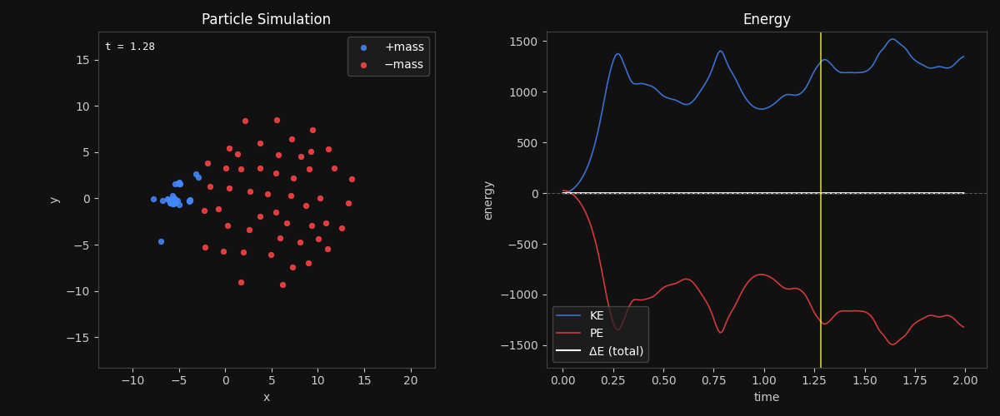
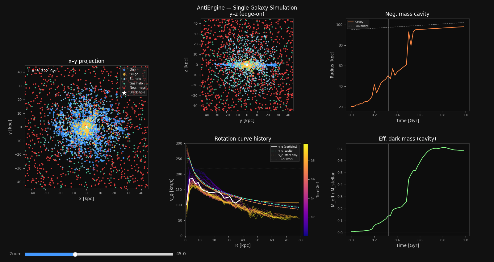
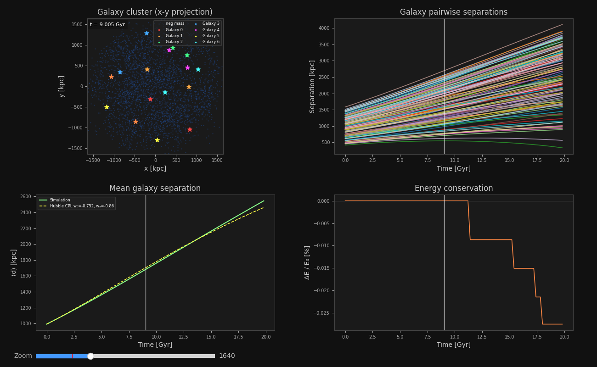
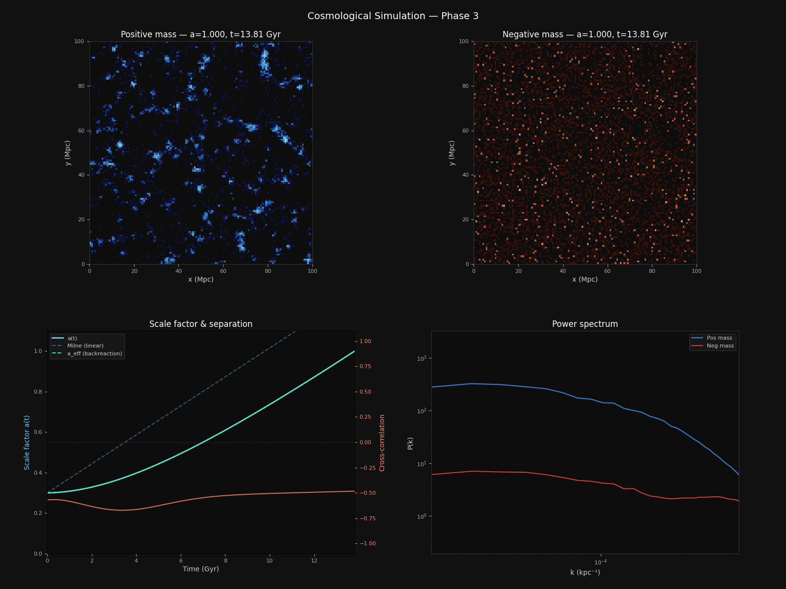
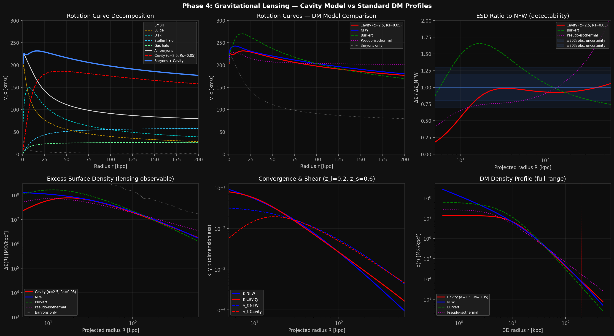
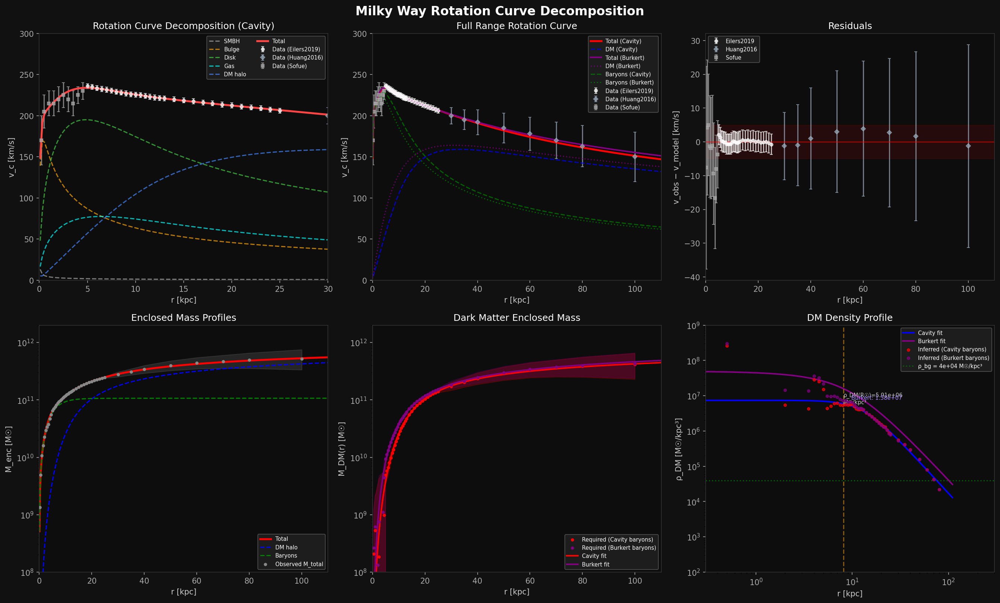
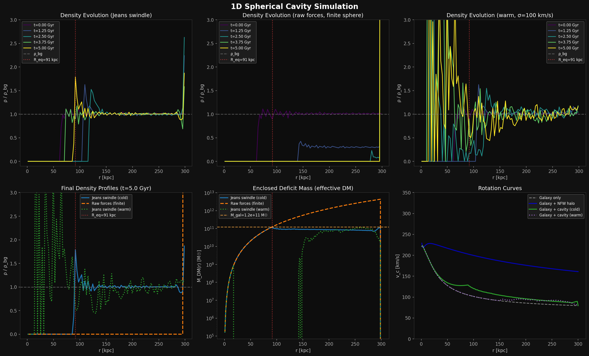
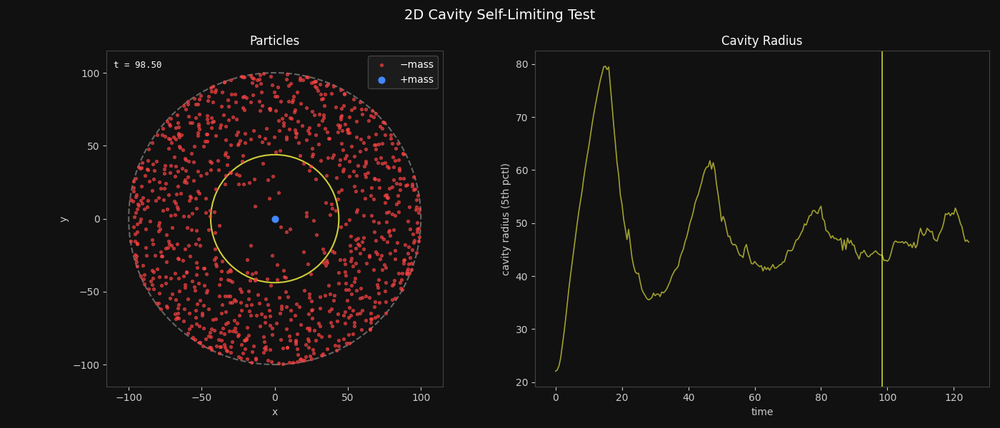
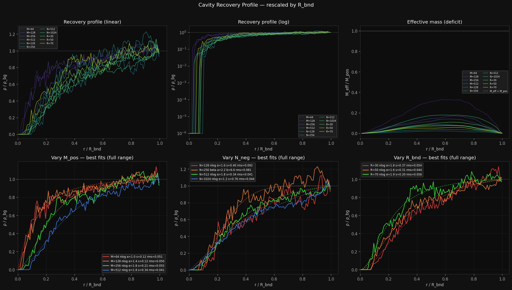

# AntiEngine

AntiEngine is a collection of physics simulations designed to test the [negative mass anti-universe model](./negative_mass_anti-universe_model.txt) at different scales. The project is built on JAX for GPU-accelerated computation and uses direct summation, particle-mesh gravity, and leapfrog integration depending on the scale of the simulation.

The code behind these simulations/tests was primarily written by Claude Sonnet/Opus 4.6 and it is my first attempt at "vibe coding". I was impressed by the results but I did provide extensive feedback and guidance so that the simulations were physically plausible and free of any obvious bugs.

## The Model

Accurately modelling the behavior of negative mass can be difficult because some models suggest that negative mass particles would mutually repel each other while other models suggest negative matter would clump together and form large clusters.

The anti-universe can be thought of as a CPT-reversed universe where time flows backwards, so we can simply imagine negative matter as normal matter moving backwards in time. In reverse, gravity looks like anti-gravity, so negative mass particles repel each other.

It's also not obvious how positive mass would interact with negative mass. Newtonian mechanics predicts runaway motion would occur, while bimetric models suggest the result would be mutual repulsion. The CPT framing can also provide some insight on this.

From the positive mass perspective, the negative mass has reversed gravity, so attraction becomes repulsion. From the negative mass perspective in the anti-universe, the positive mass similarly appears repulsive. It's a natural result of CPT-symmetry.

That is the justification for a mutually repulsive force in positive-negative interactions. Those interaction rules also turn out to be the most stable and they produce cosmic web structures that can be seen in the large scale cosmological simulation.

### Interaction Rules

| Pair | Force | Justification |
|---|---|---|
| Positive–positive | Attraction | Standard Newtonian gravity |
| Negative–negative | Repulsion | Time-reversed gravity (anti-gravity) |
| Positive–negative | Repulsion | Time-reversal, CPT symmetry |

## Simulations

### Particle (`run_particle.py`)

A 2D toy simulation testing the three interaction rules directly with small-N direct summation. Validates energy conservation, the dispersal of negative clusters, and the collapse of positive clusters.

### Single Galaxy (`run_galaxy.py`)

A 3D simulation of an Andromeda-like galaxy embedded in a surrounding negative-mass background (kpc / M☉ / Gyr units). The galaxy includes an exponential stellar disk, Hernquist bulge, stellar halo, gas halo, and central black hole.

### Galaxy Cluster (`run_cluster.py`)

Multiple galaxies embedded in a shared negative-mass background, analogous to dark energy at cluster scale. Tests whether negative-mass pressure drives Hubble-like expansion between galaxies and what neg-pos ratio works best. Uses a comoving elastic boundary to keep galaxies embedded as the system expands.

### Cosmological (`run_cosmological.py`)

Particle-mesh gravity in a periodic comoving box with a self-consistent Friedmann scale factor. Tests large-scale structure formation and the separation of the two mass sectors (into a cosmic web and anti-web). Also tests what neg-pos ratio produces the closest match to the scale and structure of the present day universe.

### Gravitational Lensing (`run_lensing.py`)

Computes predicted weak gravitational lensing signals (convergence κ, tangential shear γ) from the cavity model and compares them against NFW, Burkert, and pseudo-isothermal profiles. Tests whether the cavity model naturally produces cored density profiles consistent with observations.

### MW Rotation Curve Decomposition (`run_mw_decomposition.py`)

Fits a parametric mass model (SMBH + bulge + disk + gas + DM halo) to observed Milky Way rotation curve data from Sofue (0.2–5 kpc), Eilers (5–25 kpc), and Huang (30–100 kpc). Compares NFW, Burkert, and cavity+DM composite models, and derives a model-independent dark matter density profile.

### 1D Cavity Simulation (`run_cavity_1d.py`)

A spherically symmetric 1D simulation that solves the cavity formation problem analytically. Tests the cavity formation mechanism in spherical symmetry, tracking Lagrangian neg-mass shells around a central galaxy. The 2D cavity simulation (see below) more accurately captures the cavity profile.

### 2D Cavity Simulation (`run_cavity_2d.py`)

A 2D particle simulation with uniform random particles in a circular reflective boundary with a pinned positive mass at center. Unlike the 1D Jeans-swindle simulation, this is a full N-body with no analytical background subtraction. Reveals that the density profile of the cavity isn't uniform.

### Cavity Profiler Tool (`extract_profiles.py`)

Extracts the density profile from the 2D cavity simulation. Several parameters are varied to see how they affect the cavity profile and then the tool automatically finds the function which best fits each of those profiles. Shows that different conditions can change the cavity profile considerably.

## Key Results

### Galaxy-scale

- 95% disk retention at 0.36 Gyr after switching to N-body centripetal velocity initialisation.
- The Newtonian N-body simulation is insufficient to capture full GR effects of the cavity (effective mass computed from cavity size and background density).
- Effective rotation curve (computed from effective mass of cavity, assumes uniform density profile) shows strong uplift beyond 50+ kpc.
- Low effective mass at 50/50 neg-pos ratio suggests the **cavity model alone cannot account for the full dark matter halo** without additional mass sources.

### Cluster-scale

- **50/50 mass ratio is the best fit to DESI DR2 CPL (w₀=−0.752, wₐ=−0.86)**: the simulation tracks the DESI reference curve to ~20 Gyr without any tuning. This is more parsimonious than the expected 70/30 split (dark energy ratio).
- Emergent **dark energy decay**: neg-mass density naturally dilutes as 1/a³ as the boundary expands, producing decelerating expansion. The neg-mass model predicts w₀ > −1 and wₐ < 0 (dark energy stronger in the past) — exactly the DESI signal direction, with no tuning required.
- The cluster sim shows 50/50 matches DESI CPL at long timescales, while the cosmological sim shows R>1 produces accelerating expansion with dynamical dark energy (w_a < 0). The transition between these regimes is smooth, suggesting they may represent two perspectives on the same underlying physics.
- **Why 50/50 may be the true ratio**: The standard Ω_DE ≈ 0.68 figure counts *all positive-mass content* — baryons, radiation, neutrinos, and crucially, dark matter — against the dark energy budget. If dark matter is itself a manifestation of neg-mass effects, then the true baryonic/dark-energy split could be much closer to 50/50.
- DESI's detection of evolving dark energy shows the density is decreasing over time. This is exactly what the neg-mass model predicts and it means **the measured 68.5% fraction will change in the future** — it is not a fundamental constant. The underlying 71% fraction (see below) would be.

### Cosmological

- Scale factor follows the **Milne solution** (a = a₀ + H₀t) exactly at 50/50 mass balance. The Milne universe is mathematically identical to flat Minkowski spacetime; the apparent "open geometry" is a coordinate artifact — curvature contributions from the two species cancel globally.
- **Bounce cosmology**: for any R > 1 there is a minimum scale factor a_bounce where H = 0 — the universe cannot contract below this point. No Big Bang singularity.
- The anti-universe growth ODE predicts **structure formation much faster than ΛCDM**, which may explain JWST observations of unexpectedly massive early galaxies at z > 10.
- Anti-Correlation mode (where perturbation fields are inverted) shows formation of realistic cosmic web structures at 13.8 Gyr.
- **The R>1 model can be viewed as a generalization** that smoothly interpolates between the zero-energy Dirac-Milne universe (R=1) and a dark-energy-dominated universe (R=5/2). Extending to R>1 produces bounce cosmology and generates accelerating expansion from the Friedmann equation alone.
- R=5/2 (~71/29) produces exact rational values everywhere: a_bounce=3/10, neg%=5/7, pos%=2/7. Both R=1 (50/50) and R=5/2 give ages near 14 Gyr and both produce viable expansion histories (Milne vs accelerating).

### Gravitational Lensing

- The **cavity model naturally predicts a cored density profile**, solving the cuspy halo problem. However, a uniform cavity produces a rotation curve that doesn't match the observed flat/declining MW curve.
- A cavity with a **uniform density profile is incapable of producing significant uplift at r < 50 kpc**, however the 2D cavity sim shows that the cavity isn't uniform and a logistic density profile is possible if the neg-mass particles are energetic enough.
- The uniform cavity rotation curve rises as ∝ r (solid body), causing excessive uplift beyond 50 kpc. The **logistic profile can produce a rotation curve very similar to NFW or Burkert**, depending on the parameters.
- The baryonic components peak at ~220 km/s then decline Keplerianly. A **cored Burkert type density profile is required** to keep the rotation curve flat by providing uplift in the inner regions while still avoiding the cuspy halo problem.

### MW Rotation Curve

- NFW fit: χ²=4.7, concentration c=21 (high; explained by disk-halo degeneracy), baryon fraction f_b=6.1%
- **Burkert (cored) fit**: χ²=4.3 and f_b=15.3% — exactly the cosmic average (Ω_b/Ω_m ≈ 15.7%). The apparent "missing baryons" problem disappears with a cored halo profile. Both NFW and Burkert fit the data equally well (χ²_red ≈ 0.11), illustrating the classic disk-halo degeneracy.
- **Cavity (logistic)**: χ²=3.9 and f_b=19.1% — fits data slightly better than NFW and Burkert, predicts even higher baryon fraction.
- **Cavity + WDM**: χ²=4.3, M_bary=9.8e10 — nearly identical to the pure Burkert fit. The cavity's contribution is negligible at cosmological ρ_bg. If WDM (sterile neutrinos) IS the dark matter, and the cavity is negligible, then the **"missing baryons" in NFW fits are simply a cusp-core artifact** — the galaxy has all its baryons, they just need a cored halo profile to reveal them.
- Required neg-mass local density: ~3.9×10⁴ M☉/kpc³ (≈285× ρ_crit) — The required ~300× overdensity for neg-mass is modest compared to the ~10⁶× overdensity for positive mass in galaxies and may be a result of galaxies displacing neg-mass into surrounding volumes at enhanced density.

### 2D Cavity Sim

- Shows that the **cavity density profile is not uniform**. The neg-mass density starts near 0 at the center and rises until it meets the background density.
- **The profile shape is not universal** — it depends on the motion of neg-mass particles and the neg-pos ratio. This means a single logistic with fixed (α, Rs) is an approximation; the true profile may require accounting for the local density of neg-mass and the baryonic mass in a galaxy. Nearby galaxies may also confine the size of a galaxy's cavity and change its profile.
- The Beta CDF is the best fit for neg-mass particles with low energy but the **logistic profile starts becoming a much better fit when vel_scale increases** and/or ρ_bg in the region near the galaxy is low enough. However, a low ρ_bg also means the cavity will produce insufficient effective mass to account for dark matter.
- Although the non-uniform density profile helps the cavity produce more uplift in the inner regions, the results still suggest it is unlikely the cavity can produce the necessary uplift at those distances.

## Discussion

The cluster-scale simulation emulates the expanding balloon model of the universe and the fact it produces the observed rate of expansion (including a DESI CPL component) with a 50/50 ratio seems like compelling evidence in favour of the anti-universe model.

The expansion rate emerges naturally from the geometry and the gravitational interaction rules. The negative mass becomes more diluted over time, resulting in a dynamic rate of expansion which closely matches the observed evolution of dark energy.

The Dirac-Milne universe (Benoit-Lévy & Chardin 2012) is a matter-antimatter symmetric cosmology where antimatter has negative active gravitational mass — the same physical model implemented in AntiEngine. Their R=1 (50/50) case is the pure Milne limit of the generalized R≥1 model.

The Dirac-Milne BBN predicts η ≈ 9×10⁻⁹ (15× higher baryon density than ΛCDM), which makes the baryon density Ωb = 2/7 ≈ 0.286. All positive mass is baryonic — no non-baryonic dark matter needed. The full neg-mass budget is then 5/7 = 0.714 (71.4%).

The 68.5% DE figure emerges because standard BBN gives Ωb = 0.05, forcing the invention of ΩDM = 0.265 (a mix of "hidden baryons" and neg-mass cavity effects), which steals from the dark energy budget. What's left over (0.685) is less than the true neg-mass fraction (0.714).

The discrepancy (0.029) is exactly the portion of neg-mass cavity effects that ΛCDM misidentifies as dark matter on the matter side of the budget. This means the 68.5% is not a "measurement of reality", it's a derived quantity that depends on the assumed BBN model and dark sector decomposition.

This suggests ΛCDM is describing the same thing as the anti-universe but from a different point of view. The 50/50 ratio and the 5/2 ratio may not represent different physical scenarios but rather the same reality viewed through different theoretical frameworks.

Both ratios might be equally correct in different contexts (such as bounce cosmology) or at different scales. The cluster sim operating at galactic scales sees 50/50; the Friedmann equation integrating over the entire Hubble volume sees the domain-averaged 5/2.

While the anti-universe model may explain dark energy, the results from several simulations suggest that the cavity model is insufficient to explain the full effects of dark matter. This is somewhat unexpected considering how naturally the cavity model falls out of the anti-universe model.

The cavity likely plays an important role but the dark matter mystery remains largely unsolved for now. However, the anti-universe may still offer a hint towards the real solution. The CPT-symmetric universe (Boyle, Finn, Turok 2018) is another way of describing the anti-universe model.

The anti-universe in a CPT-symmetric framework has reversed charge, parity, and time. The model predicts three right-handed neutrinos that could account for dark matter. Crucially, these sterile neutrinos would possess positive mass and condense around galaxies, acting as dark matter.

If the negative mass anti-universe model is correct and right-handed neutrinos also exist, the combination of the cavity and sterile neutrinos should produce a specific rotation curve signature that separates it from other profiles such as NFW and Burkert.

The results of these simulations indicate there may in fact be a dark matter particle after all. The **cavity + right-handed neutrinos** model is a promising avenue for future research. The cavity provides a contribution at outer radii; a Burkert-like DM halo does the heavy lifting.

## Technical Notes

- **Units**: kpc, M☉, Gyr. G = 4.4987×10⁻⁶ kpc³ M☉⁻¹ Gyr⁻². 1 km/s = 1.0227 kpc/Gyr.
- **Integrator**: leapfrog KDK. Energy oscillates but does not drift (shadow Hamiltonian, O(dt²)).
- **float64 required**: `jax.config.update("jax_enable_x64", True)` is set globally. float32 gives poor energy conservation near the softening radius.
- **Inertial mass**: always |m| (positive), per the bimetric gravity convention. The |m_i| factor cancels from the acceleration equation.
- **Softening**: default ε=0.3 (slightly above typical inter-particle spacing for N=50 in a disk of radius ~1).
